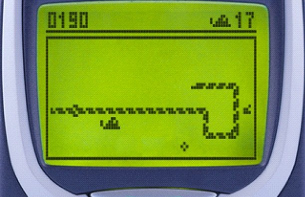

# "SnakeIT"

2024/01/22 Operating Systems Final Project Demo
Class of prof. 菅谷　みどり/SUGAYA Midori

Presentation prepared by:
- KajetanカイェタンWierszelis z523087

# Agenda
1. Service Name
2. Motivation (Describe design purpose)
3. Program Source Code 
4. Explain How to Work (Demonstration/Video OK)
5. Comments (what you learned, etc..)
<!-- footer: "2024/01/22 z523087 Operating Systems Final Project Demo" -->

<!-- paginate: true -->

# 1. Service Name 1/2

The name came from inspiration of the classic "Snake" game, as once very popular on classic Nokia phones and game consoles. I wanted to reimplement the Snake game in terminal.
<!-- _footer:  Image from: http://arduino.vn/bai-viet/674-tu-lam-game-snake-ran-moi-voi-arduino-vi-du-ve-viec-su-dung-thu-vien-xu-ly-bat-dong-bo -->

# 1. Service Name 2/2
Also, the name shorts to SIT to allude to the host university name (initially the map was supposed to be modelled after campus, but this was dropped due to lack of time). 

# 2.1. Motivation (Describe design purpose)
The service is meant to allow collecting real-time user input from multiple client terminals, and modify server-side game state parameters.

# 2.2. Design purpose in the end.
As mentioned, inspired by Snake; However due to lack of time and manpower, no GUI - just status messages.

This still allows for remote control of server from many clients.

# 3. 1. Key Features
- Server uses `fork()`, socket-handling and pipe to make multiple client connections possible
- Data sent between server and client in structures
- Utilizes `ncurses`

# 3. 2. Program Source Code.
Based on previous class 9 (Sockets and echo server code) with added basic game logic.
Shown an explained (very shortly, we only have 4 minutes per team) in `VS Codium`.

# 4.1. Explain How to Work (Demonstration/Video OK)
It's almost fully automated. How to: 
- Run `make`. 
- Select any client window
- Press some key.
- Observe received position change.
- Repeat from "press some key" step.

# 4.2. Target output (in client)
```
Pressed key code 12 at time 90803498

    Current position: (2, -5), score 2, port 33172

    Connected to server on port 33172

```

# 4.3. Target output (in client)

```
Pressed key code 18 at time 908047009

    Current position: (0, 5), score 0, port 33182

    Connected to server on port 33182

```
# 4.4. Target output (in server)
```
socket() called
bind() called
listen() called
connect from 127.0.0.1: 33172
connect from 127.0.0.1: 33182
Player position: (0, -1) Port: 33172
Player position: (1, 0) Port: 33182
[...]
Player position: (2, -3) Port: 33172
Player position: (1, 5) Port: 33182
Player position: (2, -4) Port: 33172
Player position: (0, 5) Port: 33182
Player position: (2, -5) Port: 33172

```

# 5.1. What did I learn with this particular project
- Incorporated `Makefile` to automate testing.
- Automatic random port assignment.
- How to use `ncurses` to capture keyboard input.
- Transmitting C structures via send() and recv().
- Send gamestate between parent and children of server using pipes.
- How to use zlib's `adler32` checksum.
- How to timestamp structure. (These 2 were supposed to be checked to prevent cheating and calculate ping, but not enough time to actually implement that).

# 5.2. What did I learn in general on the course
- Network communication principles (don't remember last time I had class on TCP)
- Low-level file management
- Operating Systems POSIX C programming (which now sometimes confuses me with Embedded C)

# 5.3. Main difficulties
- Pipe logic (it's confusing at times)
- Synchronization of data and input (has to make sure client and server child process transmit in same order in both programs)
- Managing this project with other project and raport deadlines

# Thank you for your attention and the course!
Presentation prepared by Kajetan Wierszelis, z523087

