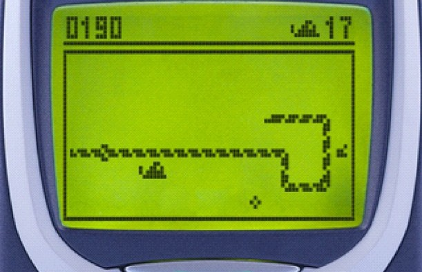

---
puppeteer:
  landscape: false
  format: "A4"
export_on_save:
    puppeteer: true # export PDF on save
---
<style>
    /* Snippet from: https://stackoverflow.com/a/39614958/22381120 */
img[alt$=">"] {
    float: right;
    max-width: 50%;
  }
  
img[alt$="<"] {
    float: left;
    max-width: 50%;
  }
  
img[alt$="><"] {
    display: block;
    max-width: 100%;
    height: auto;
    margin: auto;
    float: none!important;
  }
</style>

**2024-01-26 SnakeIT Final Project Report by Kajetan Wierszelis (カイェタン  ヴィエルシェリス)**
for Operating Systems Class of Prof. 菅谷　みどり/SUGAYA Midori

> ### Post-mortem note - git checkout:
> I did not send the program in time for the deadline, because I wanted to try to fix it before submission and document it better. Since project being managed in git, you can however check-out the last commit before deadline to see what the sources were at that time by running the following command in project directory: 
> ```
> git checkout c97ab948692f11d0cdb72f192f6412ddc873e81d
> ```

# Table of Contents
<!-- code_chunk_output -->

- [Post-mortem note - git checkout:](#post-mortem-note---git-checkout)
- [Table of Contents](#table-of-contents)
- [Service Name and Motivation](#service-name-and-motivation)
- [Proposed system](#proposed-system)
  - [Source code (implementation)](#source-code-implementation)
  - [General alghoritm (design).](#general-alghoritm-design)
    - [Post Mortem - final state of implementation:](#post-mortem---final-state-of-implementation)
- [Key Features](#key-features)
- [How to run and use.](#how-to-run-and-use)
- [Comments](#comments)
  - [Note on `git` history](#note-on-git-history)
  - [What did I learn with this particular project](#what-did-i-learn-with-this-particular-project)
  - [What did I learn in general on the course](#what-did-i-learn-in-general-on-the-course)
  - [Main difficulties](#main-difficulties)
  - [Tools used.](#tools-used)

<!-- /code_chunk_output -->


# Service Name and Motivation


The name came from inspiration of the classic "Snake" game, as once very popular on classic Nokia phones and game consoles. I wanted to reimplement the Snake game in terminal, and make it multiplayer.
Also, the name shorts to SIT to allude to the host university name (initially the map was supposed to be modelled after campus, but this was dropped due to lack of time).

# Proposed system
The service is meant to allow collecting real-time user input from multiple client terminals, and modify server-side game state parameters.
As mentioned, inspired by Snake; However due to lack of time and manpower, no GUI - just status messages.
This still allows for remote control of server from many clients.

## Source code (implementation)
Code (implementation) was explained during live presentation and in-code comments, besides it was written to be clear enough to see what's going on by just looking at it. 

## General alghoritm (design).
The designed operation sequence of the code is as follows:
1. Server is ran; it opens a Network socket interface as well as a pipe for inter-process communication between it and it's children. It then listens for any new connections and spawns chlid processes per each client.
2. Client is ran and connects to the server. ncurses then overtakes the terminal emulator window into non-echo interactive mode, to be able to intercept arrow key movements.
3. Server: Accepts connection, spawns child process which closes the main socket and establishes it's own with a given client. Rinse and repeat.
4. Server Child Process: As mentioned above, takes over the connection, Initializes Game-State for given client/player, which contains it's coordinates, port and score.
4. Client: Upon pressing any key except Q (which terminates the client), the following gets recorded in KeyInput structure:
  - Event timestamp in UNIX Epoch time
  - Pressed key's keycode, which is an 16-bit integer
  - Adler32 Checksum of the KeyInput structure containing these two fields.
5. Client: KeyInput structure gets send to server.
6. Server Child Process: Receives KeyInput structure, checks pressed Key and changes GameState(e.g. client's coordinates) accordingly, then sends it to both the parent process and client. If Q was pressed, it exits. 
7. Server Parent Process: Receives the coordinates and displays them to output console. Closes when all child processes disconnect.
8. Client: Displays received coordinates and it's assigned port.

> ### Post Mortem - final state of implementation:
> The Program should operate as described above, however at the time being code client does not seem to react to inputs and I couldn't determine the cause. The code looks like it should work. If used with the normal echo server from class 9, the client program receives all the data and operates as if normal but the game logic isn't there, hence the key gets input instead of X for example. Also, the program deadlocks easily - which is why the half-second pause was added to `Makefile` after running server process. Basically, **client program** is complete and functional, however there is something wrong with the **server program** and I ran out of time to fix this.

# Key Features
- Server uses `fork()`, socket-handling and pipe to make multiple client connections possible
- Data sent between server and client in structures
- Utilizes `ncurses`.

# How to run and use.

See `README.md`.

# Comments
## Note on `git` history
Commit history as shown by `git log` is not going to be in actual development order since I treated `git` code-keeping as a lesser priority task, and due to time constraints - often focused on developing and running the code instead of keeping track of all the changes, pushing it only when it had to be considered "final".

## What did I learn with this particular project
- Incorporated `Makefile` to automate testing.
- Automatic random port assignment.
- How to use `ncurses` to capture keyboard input.
- Transmitting C structures via send() and recv().
- Send gamestate between parent and children of server using pipes.
- How to use zlib's `adler32` checksum.
- How to timestamp structure. (These 2 were supposed to be checked to prevent cheating and calculate ping, but not enough time to actually implement that).

## What did I learn in general on the course
- Network communication principles (don't remember last time I had class on TCP)
- Low-level file management
- Operating Systems POSIX C programming (which now sometimes confuses me with Embedded C).
- (not specific to this course, but I discovered and learned those during this exchange semester) Markdown-based documentation tools: 
    - `Marp` for presentations 
    - `Markdown Preview Enhanced/Pupeteer` for raports

## Main difficulties
- Pipe logic (it's confusing at times)
- Synchronization of data and input (has to make sure client and server child process transmit in same order in both programs), can result in deadlocks easily.
- Managing this project with other project and raport deadlines, which is why I eventually failed to fix the code and prepare better documentation.

## Tools used.
Project managed under `git`.
The code was developed using `VS Codium` on `Manjaro Linux GNOME Edition`. For Terminal emulator, I used `kitty`.  See [kitty terminal emulator's website](https://sw.kovidgoyal.net/kitty/).

The Presentation was prepared using `Marp for VS Code` and `VS Codium`. [See website for Marp](https://marp.app/). Note, on Manjaro you need the `vscodium-bin-marketplace` AUR package to enable access to Microsoft's official Extension Marketplace.

I choose it since MS PowerPoint does not run on Linux (I mean, there's the in-browser version but last time I checked it was inferior to the desktop Windows one). Also writing content with code-defined formatting seems more productive than GUI editors (I used to use Google Slides before). Lastly, prefer open-source tools wherever possible, I believe they are worth investing time into and also can be forked when needed.

Raport was prepared using `Markdown Preview Enhance` extension for `VS Code` and rendered using `ungoogled-chromium` via Pupeteer backend.

